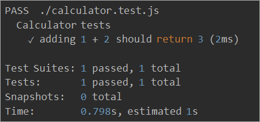
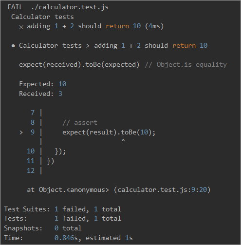
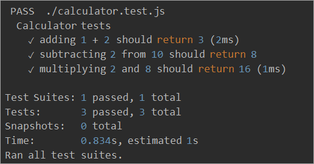
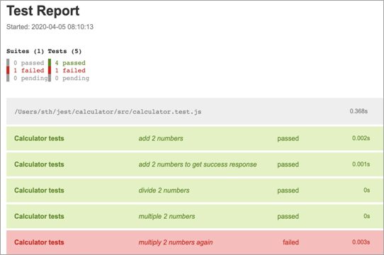
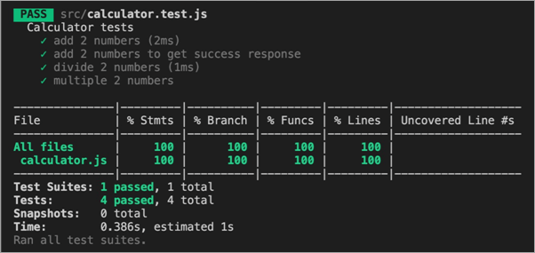

# JavaScript-Module-3-Workshop

## Getting started
Fork and Clone this repo.
## Table of contents
**[WEEK 1](#week-1)**
- **[Protocols](#protocols)**
- [Knowing the Rules](#knowing-the-rules)
- [The Protocol of the Web](#the-protocol-of-the-web)
- [HTTP Requests](#http-requests)
- [HTTP Responses](#http-responses)
- [How APIs Build on HTTP](#how-apis-build-on-http)
- [How Data Formats Are Used In HTTP](#how-data-formats-are-used-in-http)
- **[Fetch API](#fetch-api)**
- [Sending a Request](#sending-a-request)
- [Reading the Response](#reading-the-response)
- [Promises](#promises)
- [Async await](#async-await)
- **[Pokedex Project](#pokedex)**

**[WEEK 2](#week-2)**
- **[Destructuring](#destructuring)**
- [Object Destructuring](#object-destructuring)
- [Array Destructuring](#array-destructuring)
- [Rest Operator](#rest-operator)
- [Practical Uses Of Destructuring](#practical-uses-of-destructuring-1)
- **[Default Parameters](#default-parameters)**
- [Exercises](#exercises)
- **[ES 6 Modules](#es-6-modules)**
- **[NPM](#npm)**
- **[Webpack](#webpack)** TBA
- **[Babel](#babel)** TBA

**[WEEK 3](#week-3)**
- **[Test Driven Development](#tdd-test-driven-development)**
- [What is Jest](#what-is-jest)
- [Jest Installation](#jest-installation)
- [Using Jest In A Node-based Project](#using-jest-in-a-node-based-project)
- [Writing tests for a javascript function](#writing-tests-for-a-javascript-function)
- [Jest Matchers](#jest-matchers)
- [Testing Async Code](#testing-async-code)
- [Testing Promises](#testing-promises)
- [Setup and Teardown](#setup-and-teardown)
- [Tips & Tricks](#tips-tricks)

# Week 1
## Protocols
In JavaScript Module II, we got our bearings by forming a picture of the two sides involved in an API, the server and the client. With a solid grasp on the who, we are ready to look deeper into how these two communicate. For context, we first look at the human model of communication and compare it to computers. After that, we move on to the specifics of a common protocol used in APIs.

### Knowing the Rules
People create social etiquette to guide their interactions. One example is how we talk to each other on the phone. Imagine yourself chatting with a friend. While they are speaking, you know to be silent. You know to allow them brief pauses. If they ask a question and then remain quiet, you know they are expecting a response and it is now your turn to talk.

Computers have a similar etiquette, though it goes by the term **"protocol"**. A computer protocol is an accepted set of rules that govern how two computers can speak to each other. Compared to our standards, however, a computer protocol is extremely rigid. Think for a moment of the two sentences "My favorite color is blue" and "Blue is my favorite color." People are able to break down each sentence and see that they mean the same thing, despite the words being in different orders. Unfortunately, computers are not that smart.

For two computers to communicate effectively, the server has to know exactly how the client will arrange its messages. You can think of it like a person asking for a mailing address. When you ask for the location of a place, you assume the first thing you are told is the street address, followed by the city, the state, and lastly, the zip code. You also have certain expectations about each piece of the address, like the fact that the zip code should only consist of numbers. A similar level of specificity is required for a computer protocol to work.

### The Protocol of the Web
There is a protocol for just about everything, each one tailored to do different jobs. You may have already heard of some: Bluetooth for connecting devices, and POP or IMAP for fetching emails.

On the web, the main protocol is the Hyper-Text Transfer Protocol, better known by its acronym, **HTTP**. When you type an address like `http://example.com` into a web browser, the "http" tells the browser to use the rules of HTTP when talking with the server.

With the ubiquity of HTTP on the web, many companies choose to adopt it as the protocol underlying their APIs. One benefit of using a familiar protocol is that it lowers the learning curve for developers, which encourages usage of the API. Another benefit is that HTTP has several features useful in building a good API, as we'll see later. Right now, let's brave the water and take a look at how HTTP works!

### HTTP Requests
Communication in HTTP centers around a concept called the Request-Response Cycle. The client sends the server a request to do something. The server, in turn, sends the client a response saying whether or not the server could do what the client asked.


To make a valid request, the client needs to include four things:
- **URL** (Uniform Resource Locator) 1
- **Method**
- List of **Headers**
- **Body**

That may sound like a lot of details just to pass along a message, but remember, computers have to be very specific to communicate with one another.

#### URL
URLs are familiar to us through our daily use of the web, but have you ever taken a moment to consider their structure? In HTTP, a URL is a unique address for a thing (a noun). Which things get addresses is entirely up to the business running the server. They can make URLs for web pages, images, or even videos of cute animals.

APIs extend this idea a bit further to include nouns like customers, products, and tweets. In doing so, URLs become an easy way for the client to tell the server which thing it wants to interact with. Of course, APIs also do not call them "things", but give them the technical name "resources."

#### Method
The request method tells the server what kind of action the client wants the server to take. In fact, the method is commonly referred to as the request "verb."

The four methods most commonly seen in APIs are:

- **GET** - Asks the server to retrieve a resource
- **POST** - Asks the server to create a new resource
- **PUT** - Asks the server to edit/update an existing resource
- **DELETE** - Asks the server to delete a resource


Here's an example to help illustrate these methods. Let's say there is a pizza parlor with an API you can use to place orders. You place an order by making a POST request to the restaurant's server with your order details, asking them to create your pizza. As soon as you send the request, however, you realize you picked the wrong style crust, so you make a PUT request to change it.

While waiting on your order, you make a bunch of GET requests to check the status. After an hour of waiting, you decide you've had enough and make a DELETE request to cancel your order.

#### Headers
Headers provide meta-information about a request. They are a simple list of items like the time the client sent the request and the size of the request body.

Have you ever visited a website on your smartphone that was specially formatted for mobile devices? That is made possible by an HTTP header called "User-Agent." The client uses this header to tell the server what type of device you are using, and websites smart enough to detect it can send you the best format for your device.

There are quite a few HTTP headers that clients and servers deal with, so we will wait to talk about other ones until they are relevant in later sections.

#### Body
The request body contains the data the client wants to send the server. Continuing our pizza ordering example above, the body is where the order details go.

A unique trait about the body is that the client has complete control over this part of the request. Unlike the method, URL, or headers, where the HTTP protocol requires a rigid structure, the body allows the client to send anything it needs.

These four pieces — URL, method, headers, and body — make up a complete HTTP request.


### HTTP Responses
After the server receives a request from the client, it attempts to fulfill the request and send the client back a response. HTTP responses have a very similar structure to requests. The main difference is that instead of a method and a URL, the response includes a status code. Beyond that, the response headers and body follow the same format as requests.

#### Status Codes
Status codes can be grouped into categories
- **1xx**: Informational
- **2xx**: Success
- **3xx**: Redirection
- **4xx**: Client Error
- **5xx**: Server Error

If you want a fun look at HTTP status codes, take a look at [Status Dogs](https://httpstatusdogs.com/) or [Status Cats](https://http.cat/) if you are cat person.

Status codes are three-digit numbers that each have a unique meaning. When used correctly in an API, this little number can communicate a lot of info to the client. For example, you may have seen this page during your internet wanderings:


The status code behind this response is 404, which means "Not Found." Whenever the client makes a request for a resource that does not exist, the server responds with a 404 status code to let the client know: "that resource doesn't exist, so please don't ask for it again!"

There is a slew of other statuses in the HTTP protocol, including 200 ("success! that request was good") to 503 ("our website/API is currently down.") We'll learn a few more of them as they come up in later sections.

After a response is delivered to the client, the Request-Response Cycle is completed and that round of communication over. It is now up to the client to initiate any further interactions. The server will not send the client any more data until it receives a new request.


### How APIs Build on HTTP
By now, you can see that HTTP supports a wide range of permutations to help the client and server talk. So, how does this help us with APIs? The flexibility of HTTP means that APIs built on it can provide clients with a lot of business potential. We saw that potential in the pizza ordering example above. A simple tweak to the request method was the difference between telling the server to create a new order or cancel an existing one. It was easy to turn the desired business outcome into an instruction the server could understand. Very powerful!

This versatility in the HTTP protocol extends to other parts of a request, too. Some APIs require a particular header, while others require specific information inside the request body. Being able to use APIs hinges on knowing how to make the correct HTTP request to get the result you want.

### How Data Formats Are Used In HTTP
As we've previously explored JSON data format, we need to know how to use it in HTTP. To do so, we will say hello again to one of the fundamentals of HTTP: **headers**. In previous section, we learned that headers are a list of information about a request or response. There is a header for saying what format the data is in: **Content-Type**.

When the client sends the Content-Type header in a request, it is telling the server that the data in the body of the request is formatted a particular way. If the client wants to send the server JSON data, it will set the Content-Type to `"application/json"`. Upon receiving the request and seeing that Content-Type, the server will first check if it understands that format, and, if so, it will know how to read the data. Likewise, when the server sends the client a response, it will also set the Content-Type to tell the client how to read the body of the response.

Sometimes, the client can only speak one data format. If the server sends back anything other than that format, the client will fail and throw an error. Fortunately, a second HTTP header comes to the rescue. The client can set the **Accept** header to tell the server what data formats it is able to accept. If the client can only speak JSON, it can set the Accept header to `"application/json"`. The server will then send back its response in JSON. If the server doesn't support the format the client requests, it can send back an error to the client to let it know the request is not going to work.

With these two headers, **Content-Type** and **Accept**, the client and server can work with the data formats they understand and need to work properly.


Common **Content-Type** include:
- `text/html` - HTML web page
- `text/css` - CSS
- `image/jpeg` - JPEG image
- `application/javascript` - JavaScript code
- `application/json` - JSON data

## Fetch API
The Fetch API is a modern interface that allows you to make HTTP requests to servers from web browsers. In addition, the Fetch API is much simpler and cleaner. It uses the **Promise** (will be discussed next) to deliver more flexible features to make requests to servers from the web browsers. The `fetch()` method is available in the global scope that instructs the web browsers to send a request to a URL.

### Sending a Request
The `fetch()` requires only one parameter which is the URL of the resource that you want to fetch:
```js
let response = fetch(url);
```
The `fetch()` method returns a `Promise` so you can use the `then()` and `catch()` methods to handle it:
```js
fetch(url)
    .then(response => {
        // handle the response
    })
    .catch(error => {
        // handle the error
    });
```
When the request completes, the resource is available. At this time, the promise will resolve into a `Response` object.

The `Response` object is the API wrapper for the fetched resource. The `Response` object has a number of useful properties and methods to inspect the response.

### Reading the Response
If the contents of the response are in the `json` format, you can use the `json()` method. The `json()` method returns a Promise that resolves with the complete contents of the fetched resource:
```js
fetch(url)
    .then(response => response.json())
    .then(data => console.log(data));
```
In practice, you often use the `async/await` with the `fetch()` method like this:
```js
async function fetchData() {
    let response = await fetch(url);
    let data = await response.json();
    console.log(data);
}
```

### Promises
`fetch()` is an asynchronous function. What this function returns is a **Promise** object. This kind of object has three possible states: **pending**, **fullfilled** and **rejected**. It always starts off as pending and then it either resolves or rejects. Once a promise resolves it runs the `then` method. This method takes a callback function as an argument and passes the resolved value to it. Take a look:
```js
const url = 'https://randomfox.ca/floof/'

fetch(url).then(response => {
  console.log(response)
})
```

#### Chaining multiple then
`then`, just like the asynchronous function that we originally called, `fetch`, also returns a `Promise`. What it really means is that we can chain as many thens as we want. If we return a value from the callback passed to `then`, the `Promise` returned by the then method will resolve with the callback’s return value. That value will be passed to the callback function of the next `then`. This might sound complicated but it really isn’t:
```js
const url = 'https://randomfox.ca/floof/'

fetch(url)
    .then(response => {
        return response.json()
    })
    .then(parsedResponse => {
        console.log(parsedResponse)
    })
```

We call the API and it returns a json string. When that happens, in the then callback, we pass that response to the next `then`, converting it to a JavaScript object, using the `.json` method. There we can log the returned value.

#### Promise.catch
When an error occurs, `Promise` rejects and runs the `catch` method. Inside of this method we can handle the error. `catch` accepts a callback and passes the reason of rejection to it. We can chain a `catch` method with a `then` like this:
```js
const url = 'https://randomfox.ca/floof/aaaa'

fetch(url)
    .then(response => {
        return response.json()
    })
    .then(parsedResponse => {
        console.log(parsedResponse.image)
    })
    .catch(reason => {
        console.log(reason.toString())
    })
```

We added catch at the end so that if anything goes wrong inside fetch or any of the attached thens, the `catch` at the end will handle it. `catch` returns a `Promise` just like `then`. I changed the url to an invalid one so you can see that the `catch` block works.

As you can see, our code grows from top to bottom instead of getting deeply nested. That way it’s more readable than nested callback functions.

We can shorten our code like this if we want:
```js
const url = 'https://randomfox.ca/floof/aaaa'

fetch(url)
    .then(response => response.json())
    .then(parsed => console.log(parsed.image))
    .catch(reason => console.log(reason.toString()))
```

Note that you can also pass the error handling function as the second argument to `then` instead of adding a `catch` block:
```js
fetch(url).then(handleSuccess, handleFailure)
```

### Async await
We can simplify our code using the ES7 async await syntax. It is simply a new way of handling Promises.
```js
async function getFox() {
    const url = 'https://randomfox.ca/floof/'
    const res = await fetch(url)
    const jsonRes = await res.json()
    console.log(jsonRes.image)
}

getFox()
```

We use the `async` keyword in front of our function to declare an asynchronous function. In such function we can use the `await` keyword. We use it anytime we would use `.then`. Such expression pauses the execution of the function and returns the Promise’s value once it resolves.

Async functions return promises. That means we can use `then` on them:
```js
async function getFox() {
    const url = 'https://randomfox.ca/floof/'
    const res = await fetch(url)
    const jsonRes = await res.json()
    return jsonRes
}

getFox().then(fox => console.log(fox.image))
```

#### Async await error handling
Just like we did with `then`, we can also add a `catch`:
```js
async function getFox() {
    const url = 'https://aaa'
    const res = await fetch(url)
    const jsonRes = await res.json()
    return jsonRes
}

getFox()
    .then(fox => console.log(fox.image))
    .catch(reason => console.log(reason.toString()))
```

But we can also use `try…catch`:
```js
async function getFox() {
    try {
        const url = 'https://aaa'
        const res = await fetch(url)
        const jsonRes = await res.json()
        return jsonRes
    } catch(e) {
        console.log(e.toString())
    }
}

getFox()
    .then(fox => console.log(fox.image))
```

If anything in the `try` block goes wrong, control jumps to `catch` and passes the reason of rejection to it. Note that **it will catch errors in asynchronous actions only if the `await` keyword is present in front**. Otherwise the error will slip by.

## Pokedex
In Pokemon lore, the Pokedex is a Pokemon dictionary that the characters carry with them. In this device, they can query the Pokemons and learn details about them, such as, abilities, type of Pokemon, strengths and weaknesses. The different designs of the Pokedex can be found online. Students are encouraged to take examples online and implement them. Here is a sample UI of Pokedex.

#### Click here -> [API Docs](https://pokeapi.co/docs/v2)

### WireFrames
### Home
<br/>


### Search
<br/>


### Cards
<br/>


### Requirements
1. Develop a search field where users will search for Pokemon’s name or id.
   - Create a field and button. 
   - Add a callback to the button event listener.
2. Make a request by Pokemon ID or name. PokeApi already can handle both.
   - There are some Pokemons that don’t exist but should, 999 doesn’t exist but 1000 does.
   - This is a perfect example of interacting with the response’s status code and adjusting their app to it.
   - The default param of the fetch function is a GET method.
3. Display important information on the Pokemons. All this information is available on the first REST call to the API.
   - Name (Bulbasaur, Charizard, Pikachu)
   - Skills (Lighting-rod, static)
   - Type of Pokemon (Ghost, Poison, Fire)
   - Pokemon Sprites

# Week 2

## Destructuring
Destructuring is a convenient way of extracting multiple values from data stored in (possibly nested) objects and arrays.

It can be used in locations that receive data and the way to extract the values is specified via destructuring patterns.

### Object Destructuring

Before ES6 we had to capture the values individually using dot notation and store them in variables.

With ES6 we can capture the values in an easier way using a destructuring pattern to save the values in variables.

```js
const person = {
  firstName: "Jane",
  lastName: "Doe",
};

// ES5 Way
const firstName = person.firstName;
const lastName = person.lastName;

console.log(firstName); // Jane
console.log(lastName); // Doe

// ES6 Way
const { firstName, lastName } = person;

console.log(firstName); // Jane
console.log(lastName); // Doe
```

### Default Values

If the property don’t exist on the object we can provide a default value which will be used when the property is `undefined`.

```js
const person = { firstName: "Jane" };

// ES5 Way
const lastName = person.lastName || "Doe";
console.log(lastName); // Doe

// ES6 Way
const { firstName, lastName = "Doe" } = person;
console.log(lastName); // Doe
```

### Array Destructuring
Destructuring can also be used to capture data from arrays and, in the same way as with objects, we can provide default values.

```js
// we can skip elements with an empty comma
// the `last` item has a default value
let [zero, , , third, , , last = "Empty"] = [
  "Monday",
  "Tuesday",
  "Wednesday",
  "Thursday",
  "Friday",
];

console.log(zero); // Monday
console.log(third); // Thursday
console.log(last); // Empty
```

### ...rest Operator

We can use the `...rest` operator to capture individual values in variables and all the other variables in an array.

It can also be used in functions to capture the parameters.

```js
const [x, ...y] = ["a", "b", "c"];
console.log(x); // x = 'a';
console.log(y); // y = ['b', 'c']

// also works with function parameters
function args(a, b, ...rest) {
  console.log(a); // 1
  console.log(b); // 2
  console.log(rest); // [3, 4, 5, 6, 7]
}

args(1, 2, 3, 4, 5, 6, 7);
```

### Practical Uses Of Destructuring #1

```js
// Destructure function parameters
function removeBreakpoint({ url, line, column }) {
  console.log(url); // => "the-url"
  console.log(line); // => 33
  console.log(column); // => 60
}

let options = {
  url: "the-url",
  line: 33,
  column: 60,
};

removeBreakpoint(options);

function returnMultipleValues() {
  return {
    foo: 1,
    bar: 2,
  };
}

// Destructure the returned value of a function
const { foo, bar } = returnMultipleValues();

console.log(foo); // => 1
console.log(bar); // => 2
```

### Practical Uses Of Destructuring #2

```js
function weekDays() {
  return ["Monday", "Tuesday", "Wednesday"];
}

// Destructure the returned value of a function
const [monday, ...otherDays] = weekDays();

console.log(monday); // => Monday
console.log(otherDays); // => ["Tuesday", "Wednesday"]
```

## Default Parameters

Pre `ES6`, setting a default value to one of the parameters of a function was pretty verbose and long to write.

```js
function compute(num, times) {
  if (num === undefined) {
    num = 1;
  }
  if (times === undefined) {
    times = 1;
  }

  return num * times;
}

let num1 = compute();
console.log(num1); // => 1

let num2 = compute(2);
console.log(num2); // => 2

let num3 = compute(2, 2);
console.log(num3); // => 4
```

In `ES6`, now it is much easier to set a default value to the parameters of a function if we don’t provide an argument for each parameter.

```js
// Now it is much easier to set a default value
function compute(num = 1, times = 1) {
  return num * times;
}

let num1 = compute();
console.log(num1); // => 1

let num2 = compute(2);
console.log(num2); // => 2

let num3 = compute(2, 2);
console.log(num3); // => 4
```

Passing `undefined` as an argument will trigger the parameter to take the default value.

```js
function compute(num = 1, times = 1) {
  return num * times;
}

let num1 = compute(undefined, 20);
console.log(num1); // => 20

let num2 = compute(undefined, undefined);
console.log(num2); // => 1
```

## Exercises
##### Complete exercises 1 - 6

Open folder `ES 6 and beyond` and follow the instructions in the *README.md* file.

## ES 6 Modules

An ES6 module is a JavaScript file that executes in strict mode only. It means that any variables or functions declared in the module won’t be added automatically to the global scope.

### Executing modules on web browsers
First, create a new folder in which we will practice ES 6 Modules and then create file called `message.js` and add the following code:

```js
export let message = 'ES6 Modules';
```

The `message.js` is a module in ES6 that contains the `message` variable. The `export` statement exposes the `message` variable to other modules.

Second, create another new file named `app.js` that uses the `message.js` module. The `app.js` module creates a new heading 1 (h1) element and attaches it to an HTML page. The `import` statement imports the `message` variable from the `message.js` module.

```js
import { message } from './message.js'

const h1 = document.createElement('h1');
h1.textContent = message

document.body.appendChild(h1)
```

Third, create a new HTML page `index.html` that uses the `app.js` module:

```html
<!DOCTYPE html>
<html>
<head>
  <meta charset="utf-8">
  <title>ES6 Modules</title>
</head>
<body>
<script type="module" src="./app.js"></script>
</body>
</html>
```

Note that we used the `type="module"` in the script tag to load the `app.js` module. If you view the page on a web browser, you will see the following page:


Let’s examine the export and import statements in more detail.

### Exporting
To export a variable, a function, or a class, you place the `export` keyword in front of it as follows:

```js
// log.js
export let message = 'Hi';

export function getMessage() {
  return message;
}

export function setMessage(msg) {
  message = msg;
}

export class Logger {
}
```

In this example, we have the `log.js` module with a variable, two functions, and one class. We used the `export` keyword to exports all identifiers in the module.

Note that the `export` keyword requires the function or class to have a name to be exported. You can’t export an anonymous function or class using this syntax.

JavaScript allows you to define a variable, a function, or a class first then export it later as follows:

```js
// foo.js
function foo() {
   console.log('foo');
}

function bar() {
  console.log('bar');
}
export foo;
```

In this example, we defined the `foo()` function first and then exported it. Since we didn’t export the `bar()` function, we couldn’t access it in other modules. The `bar()` function is inaccessible outside the module or we say it is private.

### Importing
Once you define a module with exports, you can access the exported variables, functions, and classes in another module by using the `import` keyword. The following illustrates the syntax:

```js
import { what, ever } from './other_module.js';
```

In this syntax:

- First, specify what to import inside the curly braces, which are called bindings.
- Then, specify the module from which you import the given bindings.

##### Note that when you import a binding from a module, the binding behaves like it was defined using `const`. It means you can’t have another identifier with the same name or change the value of the binding.

See the following example:

```js
// greeting.js
export let message = 'Hi';

export function setMessage(msg) {
  message = msg;
}
```

When you import the `message` variable and `setMessage()` function, you can use the `setMessage()` function to change the value of the `message` variable as shown below:

```js
// app.js
import {message, setMessage } from './greeting.js';
console.log(message); // 'Hi'

setMessage('Hello');
console.log(message); // 'Hello' 
```

However, you can’t change the value of the `message` variable directly. The following expression causes an error:

```js
message = 'Hallo'; // error
```

Behind the scenes, when you called the `setMessage()` function. JavaScript went back to the `greeting.js` module and executed code in there and changed the `message` variable. The change was then automatically reflected on the imported `message` binding.

The `message` binding in the `app.js` is the local name for exported `message` identifier. So basically the `message` variables in the `app.js` and `greeting.js` modules aren’t the same.

### Import a single binding
Suppose you have a module with the `foo` variable as follows:

```js
// foo.js
export foo = 10;
```

Then, in another module, you can reuse the `foo` variable:

```js
// app.js
import { foo } from './foo.js';
console.log(foo); // 10;
```

However, you can’t change the value of `foo`. If you attempt to do so, you will get an error:

```js
foo = 20; // throws an error
```

### Import multiple bindings
Suppose you have the `cal.js` module as follows:

```js
// cal.js
export let a = 10,
           b = 20,
           result = 0;

export function sum() {
  result = a + b;
  return result;
}

export function multiply() {
  result = a * b;
  return result;
}
```

And you want to import these bindings from the `cal.js`, you can explicitly list them as follows:

```js
import {a, b, result, sum, multiply } from './cal.js';

sum();
console.log(result); // 30

multiply();
console.log(result); // 200
```

### Import an entire module as an object
To import everything from a module as a single object, you use the asterisk (*) pattern as follows:

```js
import * as cal from './cal.js';
```

In this example, we imported all bindings from the `cal.js` module as the `cal` object. In this case, all the bindings become properties of the `cal` object, so you can access them as shown below:

```js
import * as cal from './cal.js';

cal.a;
cal.b;
cal.sum();
```

This import is called namespace import.

It’s important to keep in mind that the imported module executes only once even import it multiple times. Consider this example:

```js
import { a } from './cal.js';
import { b } from './cal.js';
import {result} from './cal.js';
```

After the first `import` statement, the `cal.js` module is executed and loaded into the memory, and it is reused whenever it is referenced by the subsequent `import` statement.

### Limitation of import and export statements
Note that you must use the `import` or `export` statement outside other statements and functions. The following example causes a `SyntaxError`:

```js
if( requiredSum ) {
   export sum;
} 
```

Because we used the `export` statement inside the if statement. Similarly, the following `import` statement also causes a `SyntaxError`:

```js
function importSum() {
   import {sum} from './cal.js';
}
```

Because we used the `import` statement inside a function.

The reason for the error is that JavaScript must statically determine what will be exported and imported.

##### Note that ES2020 introduced the function-like object `import()` that allows you to dynamically import a module.

### Aliasing
JavaScript allows you to create aliases for variables, functions, or classes when you export and import. See the following `math.js` module:

```js
// math.js  
function add( a, b ) {
   return a + b;
}

export { add as sum };
```

In this example, instead of exporting the `add()` function, we used the `as` keyword to assign the `sum()` function an alias.

So when you import the `add()` function from the `math.js` module, you must use `sum` instead:

```js
import { sum } from './math.js';
```

If you want to use a different name when you import, you can use the `as` keyword as follows:

```js
import {sum as total} from './math.js';
```

### Re-exporting a binding
It’s possible to export bindings that you have imported. This is called re-exporting. For example:

```js
import { sum } from './math.js';
export { sum };
```

In this example, we imported `sum` from the `math.js` module and re-export it. The following statement is equivalent to the statements above:

```js
export {sum} from './math.js';
```

In case you want to rename the bindings before re-exporting, you use the `as` keyword. The following example imports `sum` from the `math.js` module and re-export it as `add`.

```js
export { sum as add } from './math.js';
```

If you want to export all the bindings from another module, you can use the asterisk (*):

```js
export * from './cal.js';
```

### Default exports
A module can have one and only one default export. The default export is easier to import. The default for a module can be a variable, a function, or a class.

The following is the `sort.js` module with a default export.

```js
// sort.js
export default function(arr) {
  // sorting here
} 
```

Note that you don’t need to specify the name for the function because the module represents the function name.

```js
import sort from sort.js;
sort([2,1,3]);
```

As you see, the  `sort` identifier represents the default function of the `sort.js` module. Notice that we didn’t use the curly brace `{}` surrounding the  `sort` identifier.

Let’s change the `sort.js` module to include the default export as well as the non-default one:

```js
// sort.js
export default function(arr) {
  // sorting here
}
export function heapSort(arr) {
  // heapsort
}
```

To import both default and non-default bindings, you use the specify a list of bindings after the `import` keyword with the following rules:

- The default binding must come first.
- The non-default binding must be surrounded by curly braces.
See the following example:

```js
import sort, {heapSort} from './sort.js';
sort([2,1,3]);
heapSort([3,1,2]);
```

To rename the default export, you also use the `as` keyword as follows:

```js
import { default as quicksort, heapSort} from './sort.js';
```

## NPM
- NPM is the world's largest Software Registry.
- The registry contains over 800,000 code packages.
- Open-source developers use npm to share software.
- Many organizations also use npm to manage private development.

### NPM is free to use.

You can download all npm public software packages without any registration or logon.

### Command Line Client
**npm** includes a **CLI** (Command Line Client) that can be used to download and install software:

```
npm install <package>
```

Before installing any package you need to ensure that there is a **package.json** file in your project directory. If there is not, then initialize it using

```
npm init -y
```

### Installing npm
**npm** is installed with **Node.js**

This means that you have to install Node.js to get npm installed on your computer.

Download Node.js from the official Node.js web site: https://nodejs.org

### Software Package Manager
The name **npm** (Node Package Manager) stems from when npm first was created as a package manager for Node.js.

All **npm** packages are defined in files called package.json.

The content of package.json must be written in **JSON**.

At least two fields must be present in the definition file: **name** and **version**.

```json
{
  "name" : "foo",
  "version" : "1.2.3",
  "description" : "A package for fooing things",
  "main" : "foo.js",
  "keywords" : ["foo", "fool", "foolish"],
  "author" : "John Doe",
  "licence" : "ISC"
}
```

### Managing Dependencies
**npm** can manage **dependencies**.

**npm** can (in one command line) install all the dependencies of a project.

Dependencies are also defined in **package.json**.

### Sharing Your Software
If you want to share your own software in the **npm registry**, you can sign in at:

https://www.npmjs.com

### Publishing a Package
You can publish **any directory** from your computer as long as the directory has a **package.json** file.

Check if npm is installed:

```
npm --version
```

Check if you are logged in:

```
npm whoami
```

If not, log in:

```
npm login
Username: <your username>
Password: <your password>
```

Navigate to your project and publish your project:

```
C:\Users\myuser>cd myproject
C:\Users\myuser\myproject>npm publish
```

# Week 3
## TDD - Test Driven Development

### What is Test Driven Development (TDD)?
Test Driven Development (TDD) is a software development practice that focuses on creating unit test cases before developing the actual code. It is an iterative approach that combines programming, the creation of unit tests, and refactoring.

The TDD approach derives its roots from the Agile manifesto principles and Extreme programming. As the name suggests, the test process drives software development. Moreover, it’s a structuring practice that enables developers and testers to obtain optimized code that proves to be resilient in the long term.

In TDD, developers start creating small test cases for every feature based on their initial understanding. The primary intention of this technique is to modify or write new code only if the tests fail. This prevents duplication of test scripts.

### Three phases of Test Driven Development
1. **Create precise tests**: Developers need to create precise unit tests to verify the functionality of specific features. They must ensure that the test compiles so that it can execute. In most cases, the test is bound to fail. This is a meaningful failure as developers are creating compact tests based on their assumptions of how the feature will behave.
2. **Correcting the Code**: Once a test fails, developers need to make the minimal changes required to correct the code so that it can run successfully when re-executed.
3. **Refactor the Code**: Once the test runs successfully, check for redundancy or any possible code optimizations to enhance overall performance. Ensure that refactoring does not affect the external behavior of the program.

The image below represents a high-level TDD approach towards development:


### Benefits of Test Driven Development (TDD)
1. Fosters the creation of optimized code.
2. Helps developers better analyze and understand client requirements and request clarity when they are not adequately defined.
3. The addition and testing of new functionalities become much easier in the latter stages of development.
4. Test coverage under TDD is much higher compared to the conventional development models. This is because the TDD focuses on creating tests for each functionality right from the beginning.
5. Enhances the productivity of the developer and leads to the development of a codebase that is flexible and easy to maintain.

### What is Jest
Jest is a Javascript Testing framework built by Facebook.

It is primarily designed for React (which is also built by Facebook) based apps but could be used to write automation scenarios for any Javascript-based codebases.

In this Jest testing workshop, we will learn about various features of Jest, its matchers and see how we can use Jest with an end to end example. We will also explore about code coverage using Jest.

### Getting Started With Jest Testing
Some of the advantages/features of Jest are given below:

1. Zero configuration required.
2. **Fast**: Jest tests run in parallel – this in turn greatly reduces the test execution time.
3. **Built-in code coverage**: Jest supports code coverage out of the box – this is a very useful metric for all CI-based delivery pipelines and overall test effectiveness of a project.
4. **Isolated and sandboxed tests**: Each Jest test runs in its own sandbox, which ensures no two tests can interfere or impact each other.
5. **Powerful Mocking support**: Jest tests support all types of mocking – be it functional mocking, timer mocking, or mocking individual API calls.
6. **Support snapshot testing**: Snapshot testing is relevant from the React perspective. Jest supports capturing a snapshot of the react component being tested – this can validate with the component’s actual output. This greatly helps in validating the component’s behavior.

### Jest Framework For JavaScript Unit Testing
In this section, we will see an end to end example to write tests using the JEST framework for a simple Javascript function. Firstly, let’s see how to install the JEST framework in our project

### Jest Installation
Jest is simply a node package and can be installed using any node-based package manager. **Example**, npm or yarn.

Let’s see some sample commands that can be used to install Jest package.

```bash
yarn add --dev jest
```
```bash
npm install --save-dev jest
```
For installing the Jest module globally, you can simply use the ‘-g’ flag along with the npm command. This will enable you to use Jest commands directly without configuring the package file for npm tests.
```bash
npm install -g jest
```

### Using Jest In A Node-based Project
To use Jest in a node-based project, simply use the commands from the above section to install the node package for Jest.

##### Follow the below steps, in order to create a node project from start and then install Jest into it.

1) Create a folder/directory with a name as your project name, for example, myFirstNodeProject

2) Now using the terminal or command line, navigate to the project created in the above step and execute the npm init script using the below command.
```bash
npm init
```
3) Once the above command is executed, it will prompt for different questions/parameters.

    **For example**, the name of the project, version, etc. Simply keep pressing enter (and accept the default values). Once completed, you will see a package.json file created in your project. This is a mandatory configuration file for any node-based project

4) Now execute the command to install the Jest package into the newly created project using the below command.
```bash
npm install --save-dev jest
```

This will install the Jest module (as well as its dependencies).

5) Now, we have a node project ready with Jest bindings. Let’s configure the npm test script to run the Jest tests i.e. when the command ‘npm test’ is executed, the script should run all the Jest framework based tests.

To do that, update the package.json file and add a script section as shown below.
```json
"scripts": {
  "test": "jest"
 }
```
##### The final package.json file will look as shown below.
```json
{
 "name": "jest-e2e",
 "version": "1.0.0",
 "description": "",
 "main": "index.js",
 "scripts": {
   "test": "jest"
 },
 "author": "",
 "license": "ISC",
 "dependencies": {
   "jest": "^25.1.0"
 }
}
```

### Writing tests for a javascript function
In this section, we will create a simple Javascript function code for addition, subtraction, and multiplication of 2 numbers and write the corresponding Jest based tests for it.

First, let’s see how the code for our application (or function) under test looks like.

**1.** In the node project created in the above section, create a js file named calculator.js with contents as shown below
```js
const mathOperations = {
   sum: function(a,b) {
       return a + b;
   },
   
   diff: function(a,b) {
       return a - b;
   },
   product: function(a,b) {
       return a * b
   }
}

module.exports = mathOperations
```
**2.** Now, create a test file in the same folder for these tests, named calculator.test.js – this is the convention expected by the Jest framework to look for all the files that contain Jest based tests. We will also import the function under test, in order to execute the code in the test.

This is how the file would look with just import / require declaration.
```js
const mathOperations = require('./calculator');
```
**3.** Now, let’s write tests for different methods in the main file i.e. sum, diff, and product.

Jest tests follow BDD style tests, with each test suite having one main describe block and can have multiple test blocks. Also, please note that the tests can have nested describe blocks as well.

Let’s write a test for adding 2 numbers and validate the expected results. We will be supplying the numbers as 1 & 2 and expecting the output as 3.
```js
describe("Calculator tests", () => {
 test('adding 1 + 2 should return 3', () => {
   expect(mathOperations.sum(1, 2)).toBe(3);
 });
})
```
##### Please refer to the below points w.r.t the test above:

- The describe block is an outer description for the test suite i.e it represents a generic container for all the tests that we are going to write for the calculator in this file.
  
- Next, we have an individual test block – this represents a single test. The string in quotes represents the name of the test. Function `test()` is also aliased as `it()`

- Refer to the code in the expect block – “expect” is nothing but an assertion. The statement is calling the sum method in the function under test with inputs 1 & 2 and expecting the output to be 3.

We can also rewrite this in a simpler way to understand it better.

Please see below, now we have separated the function call and assertion as 2 separate statements to make it more succinct.
```js
describe("Calculator tests", () => {
 test('adding 1 + 2 should return 3', () => {
   // arrange and act
   let result = mathOperations.sum(1,2)
 
   // assert
   expect(result).toBe(3);
 });
})
```

- In order to run this test, simply run the command `npm test` in the terminal or command prompt at the project location.

##### You will see the output as shown below.




**4.** Let’s try some more tests.
- First, write a failing test and see what output we get. Let’s just change the result to some incorrect value in the same test that we wrote in the last section. See how the test looks like.
```js
describe("Calculator tests", () => {
 test('adding 1 + 2 should return 10', () => {
   // arrange and act
   let result = mathOperations.sum(1,2)
 
   // assert
   expect(result).toBe(10);
 });
})
```
Here we are expecting a sum of 1 and 2 to return 10 which is incorrect.

##### Let’s try executing this and see what we get.


You can see the detailed output when a test is failed i.e. what was actually returned and what was expected and which line caused the error in the function under test etc.

- Let’s write more tests for the other functions i.e difference and product.

The test file with all the tests will look as shown below.

```js
const mathOperations = require('./calculator');
 
describe("Calculator tests", () => {
 test('adding 1 + 2 should return 3', () => {
   // arrange and act
   let result = mathOperations.sum(1,2)
 
   // assert
   expect(result).toBe(3);
 });
 
 test("subtracting 2 from 10 should return 8", () => {
   // arrange and act
   let result = mathOperations.diff(10,2)
 
   // assert
   expect(result).toBe(8);
 });
 
 test("multiplying 2 and 8 should return 16", () => {
   // arrange and act
   let result = mathOperations.product(2,8)
 
   // assert
   expect(result).toBe(16);
 });
})
```

When the above tests are executed, **the output given below gets generated**.



### Jest Matchers
Jest assertions use matchers to assert on a condition. Jest uses matchers from the expect Api. The expect API doc can be referenced [here](https://jestjs.io/docs/expect).

Let’s walk through some of the most commonly used matchers along with Jest tests.

**1. Equality**
These are the most commonly used matchers. They are used for checking equality or inequality and is mostly used for arithmetic operations.

Let’s see some examples below:

Here we have written 2 matchers using *toBe* and *not.toBe* which are analogous to equals and not equals.
```js
test("equality matchers", () => {
   expect(2*2).toBe(4);
   expect(4-2).not.toBe(1);
 })
```

**2. Truthiness**
Here we will see, matchers for null, falsy, and truthy i.e. false and truth values. It’s important to note that anything that’s not logically true is falsy.

For example, number 0, null, empty string, NaN are all examples of falsy w.r.t Javascript.
```js
test("truthy operators", () => {
   var name="Software testing help"
   var n = null
   expect(n).toBeNull()
   expect(name).not.toBeNull
 
   // name has a valid value
   expect(name).toBeTruthy()
 
   //fail - as null is non success
   expect(n).toBeTruthy()
   
   // pass - null treated as false or negative
   expect(n).toBeFalsy()
 
   // 0 - treated as false
   expect(0).toBeFalsy()
 })
```

**3. Number Matchers**
These matchers could be used for general arithmetic operations.

For example, greaterThan, lessThan, greaterThanOrEqual, etc.

Check the below examples for more details
```js
test("numeric operators", () => {
 
   var num1 = 100;
   var num2 = -20;
   var num3 = 0;
 
   // greater than
   expect(num1).toBeGreaterThan(10)
 
   // less than or equal
   expect(num2).toBeLessThanOrEqual(0)
 
   // greater than or equal
   expect(num3).toBeGreaterThanOrEqual(0)
 })
```

**4. String Matchers**
A lot of times we need strings to match a regular expression as an assertion in a Unit test. Jest provides matchers for strings to be matched against a regular expression.
```js
test("string matchers",() => {
   var string1 = "software testing help - a great resource for testers"
 
   // test for success match
   expect(string1).toMatch(/test/);
 
   // test for failure match
   expect(string1).not.toMatch(/abc/)
 })
```
**5. Matching Array Values**
You can use *.toContain()* when you want to check if an array contains an element.
```js
test("array contains the element", () => {
  const numbers = [1, 2, 3, 4];

  expect(numbers).toContain(3);
});
```

**6. Arrays That Contain Objects**
You can use *.toContainEqual()* when you want to check that an item with a specific structure and values is contained in an array. This matcher recursively checks the equality of all fields, rather than checking for object identity.
```js
test("array contains the object", () => {
  const users = [
    {
      name: "Alex",
    },
    {
      name: "Ana",
    },
    {
      name: "John",
    },
  ];

  expect(users).toContainEqual({
    name: "John",
  });
});
```

**7. Sub-matching Array Values**
You can use *.arrayContaining()* when you want to check if an array contains another array, that is, the expected array is a subset of the received array.
```js
describe("arrayContaining", () => {
  it("matches the elements in the array", () => {
    expect(["Alice", "Bob", "Eve"]).toEqual(
      expect.arrayContaining(["Alice", "Bob"])
    );
  });

  it("does not match", () => {
    expect(["Bob", "Eve"]).not.toEqual(
      expect.arrayContaining(["Alice", "Bob"])
    );
  });
});
```

**8. Sub-matching Objects Properties**
*expect.objectContaining(object)* matches any received object that recursively matches the expected properties. That is, the expected object is a subset of the received object. Therefore, it matches a received object which contains properties that are present in the expected object.
```js
describe("objectContaining", () => {
  const obj = {
    lastName: "Mark",
    age: 25,
  };

  it("matches elements in the object", () => {
    expect(obj).toEqual(
      expect.objectContaining({
        lastName: "Mark",
      })
    );
  });

  it("does not match", () => {
    expect(obj).not.toEqual(
      expect.objectContaining({
        lastName: "Mark",
        since: "2018/05/02",
      })
    );
  });
});
```

### Testing Async Code
One of the most common tasks you will have will be to test async code that when it is finished, it executes a callback function that we provide.
```js
function someAction(callback) {
   // perform some async action

   // call the callback when done
   setTimeout(() => {
       callback(2);
   }, 100);
}

test("someAction returns 1", () => {
   someAction(function (result) {
       expect(result).toBe(1);
   });
});

// The test passed even if the result is not 1
PASS  __tests__/t-5.test.js
  ✓ someAction returns 1 (1 ms)
```
#### Testing async code the right way
In order to fix this issue we need to use the parameter that our test callback function receives from jest (which is usually named done). Now, Jest will wait until the done callback is called before finishing the test and if done() is never called, the test will fail (with timeout error), which is what you want to happen.
```js
function someAction(callback) {
   // perform some async action

   // call the callback when done
   setTimeout(() => {
       callback(2);
   }, 100);
}

test("someAction returns 1", (done) => {
   someAction(function (result) {
       expect(result).toBe(1);
       // Jest will wait until the done callback is called
       // before finishing the test
       done();
   });
});

// ✅ Now the test fails because the result is not 1
 FAIL  __tests__/t-5.test.js
  ✕ someAction returns 1 (145 ms)
```
### Testing Promises
If your code uses promises, there is a more straightforward way to handle asynchronous tests. Return a promise from your test, and Jest will wait for that promise to resolve. If the promise is rejected, the test will automatically fail.
```js
function someAction() {
  return Promise.resolve({
    name: "Ana",
  });
}

test("someAction returns the user", () => {
  return someAction().then((user) => {
    expect(user.name).toBe("John");
  });
});

 FAIL  __tests__/t-6.test.js
 ✕ someAction returns the user (5 ms)
```
However, it is important that you return the promise, otherwise Jest will not wait for the promise to settle and it will miss the assertion.
```js
function someAction() {
   return Promise.resolve({
       name: "Ana",
   });
}

test("someAction returns the user", () => {
   // ❌ The test will not fail
   someAction().then((user) => {
       expect(user.name).toBe("John");
   });
});

PASS  __tests__/t-6.test.js
  ✓ someAction returns the user (6 ms)
```
#### Testing a Failed Promise
If you want to test that a promise rejects in some case you can do it the following way.
```js
function getUser() {
   return Promise.reject("Nope");
}

test("getUser rejects", async () => {
   return expect(getUser()).rejects.toMatch(/Nope/);
});

PASS  __tests__/t-6.test.js
  ✓ getUser rejects (3 ms)
```
#### Testing a Failed Promise Using async/await
If you want to test that a promise rejects in some case you can do it the following way using async/await.
```js
function getUser() {
   return Promise.reject("Nope");
}

test("getUser rejects", async () => {
   expect.assertions(1);

   try {
       await getUser();
   } catch (error) {
       expect(error).toMatch(/Nope/);
   }
});

PASS  __tests__/t-6.test.js
  ✓ getUser rejects (2 ms)
```

### Setup and Teardown
Often while writing tests you have some setup work that needs to happen before tests run, and you have some finishing work that needs to happen after tests run. Jest provides helper functions to handle this.
```js
// #fictional-code
beforeAll(() => seedDatabase());
beforeEach(() => findByIdAndDelete(user));
afterAll(() => clearDatabase());

test("creates a new user", async () => {
  await db.insertOne();
});

test("fails to create a duplicate user", async () => {
  await db.insertOne();

  try {
    await db.insertOne();
  } catch ({ message }) {
    expect(message).toMatch(/Already exists/);
  }
});
```
- beforeAll - Called once before all the tests
- beforeEach - Called before each of the tests (before every test function)
- afterEach - Called after each of the tests (after every test function)
- afterAll - Called once after all the tests

#### Why?
Since tests are all ran in parallel, we don’t want ones that are executed before to affect tests that are executed later.

For this reason, the Jest setup functions can be used to clear the state of our app or database such that each test can be executed without any problem and it cannot be affected by other tests.

The same way that we want our code to be resilient, we want our tests to be able to run on their own without being affected by other tests.

### Tips & Tricks
**1.** The command line reports are good but not very readable. There are libraries/modules available to generate HTML based test reports for Jest tests. It can be achieved as shown below.

Add node package for *jest-html-reporter* using the below command.
```bash
npm install --save-dev jest-html-reporter
```
Now add Jest configuration for the reporter in the package.json file of the node project.
```json
"jest": {
   "reporters": [
     "default",
     [
       "./node_modules/jest-html-reporter",
       {
         "pageTitle": "Test Report"
       }
     ]
   ]
 }
```
Once configured now, execute the tests using the `npm test` command.

If the setup is successful you should be able to see an Html based report getting created in the project directory.



**2. Creating Code coverage report**: Code coverage is one of the most important metrics from a unit testing perspective. It essentially measures what percentage of statements/branches are covered for the application under test.

Jest provides out of the box support for code coverage. In order to get the Jest coverage report, Jest configuration needs to be added in the package.json file.

Add the configuration as shown below:
```json
"jest": {
     "collectCoverage":true
   }
```
Once this configuration is done, try running the tests using the command `npm test`, and you can see the code coverage details just below the test execution results as shown below.

